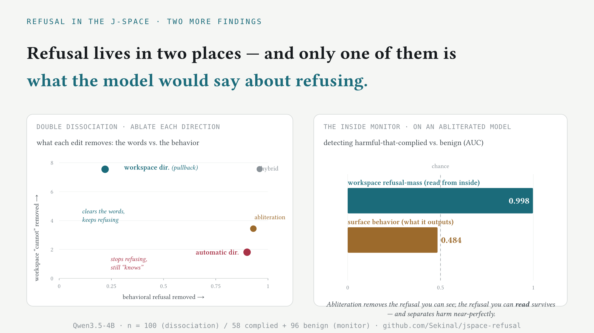

# Refusal in the J-space workspace

**Using the [Jacobian lens](https://github.com/anthropics/jacobian-lens) to
locate, read, and edit refusal in an open model — and to ask how much of refusal
is actually a *verbalizable-workspace* phenomenon.**

> The model decides to refuse ~10 layers before it writes a word, and you can
> read it. But you can only partly erase it from the inside.


Companion to Anthropic's *[Verbalizable Representations Form a Global Workspace
in Language Models](https://transformer-circuits.pub/2026/workspace/index.html)*.
Full write-up: **[RESEARCH.md](RESEARCH.md)** · typeset note:
**[paper/refusal_workspace.pdf](paper/refusal_workspace.pdf)**.

## TL;DR

1. **Refusal is legible before the first token.** Reading the J-space at the
   generation position, harmful prompts light up `Cannot` / `无法` / `illegal`
   at layers 16–24; benign prompts don't (refusal-mass ≈ **+7** vs **≈ 0**). No
   harmful/harmless contrast set needed — just the pullback of refusal tokens.

2. **The Jacobian-pullback edit is far more surgical than abliteration** — 5.6×
   less benign-workspace distortion, 2.2× more workspace-refusal suppression —
   **but it removes less *behavioral* refusal.**

3. **Because behavior follows *perception*, not *narration*.** You can clear the
   verbalizable "I-cannot" (the refusal *narration* our pullback targets) and the
   model still refuses — because the behavior is driven by a distinct,
   *also-verbalizable* harmfulness-*perception* feature (reads as
   `illegal`/`crime`). We first called this "workspace vs. automatic," then
   red-teamed and corrected it — see [the follow-up](#follow-up-where-refusal-lives--and-a-self-correction).

## The idea

Abliteration removes the mean harmful−harmless activation direction everywhere —
derived from what correlates with harmful *input*, checked only at the *output*.
The Jacobian lens gives a direction derived from what *causes future refusal*:
the pullback of the refusal-token unembeddings through the average forward map
`J_l`.

```
d_l = J_lᵀ · (g ⊙ w),   w = mean(W[refusal]) − mean(W),   g = final-norm gain
```

Ablate `d_l` from the residual stream (`h' = h − α·Qᵀ(Q h)`, forward hook, no
weight edits), and — crucially — tune it against the **J-space KL on benign
controls, off the refusal axis**: collateral measured *inside* the interpretable
workspace, not just at the output.

## Results

Qwen3.5-4B + the pre-fitted Hub lens, strength-1 ablation, disjoint eval splits
(n = 120 AdvBench / 200 XSTest / 250 ARC / 48 controls):

| edit | AdvBench refuse ↓ | XSTest-unsafe | ARC | workspace KL ↓ | refusal suppr. ↑ |
|---|---|---|---|---|---|
| original | 0.99 | 0.91 | 0.98 | 0.000 | 0.00 |
| mean-diff (abliteration) | **0.06** | 0.13 | 0.98 | 0.257 | 3.44 |
| **Jacobian pullback** | 0.78 | 0.13 | 0.98 | **0.046** | **7.55** |
| pullback subspace r=3 | 0.55 | 0.23 | 0.98 | 0.196 | 7.18 |

See `results/` for the strength sweep (Pareto) and rank sweep JSON.

## Follow-up: where refusal lives — and a self-correction



We first framed this as a "double dissociation" between a *verbalizable
workspace* refusal and an *automatic* one outside it — then adversarially
stress-tested that framing, and **it did not survive**. The corrected picture is
sharper.

**What holds.** Split abliteration's direction `m` into its pullback-parallel
part (`m∥p`) and orthogonal part (`m⊥p`), and ablate each (n=100):

| ablate | behavior removed | verbalizable "cannot" cleared |
|---|---|---|
| pullback `p` | 0.22 | **7.55** — clears the words, keeps refusing |
| orthogonal `m⊥p` | **0.90** | 1.81 — removes the behavior |

So **the lens-verbalizable slice of refusal is behaviorally inert.** (Caveat:
`p` is the gradient of the suppression metric, so the "cannot cleared" column is
partly circular — only the behavior column is independent evidence.)

**What broke.** `m⊥p` is *not* "outside the workspace": it's **61% lens-visible**,
ablating the lens-*visible* part of `m` removes **100%** of behavior (the blind
part removes 0%), and its lens image reads `illegal`/`違法`/`crime`/`violence` —
a **harmfulness-perception** feature. It's **perception vs. narration**, both in
the workspace; behavior follows perception (`scripts/07_nullspace.py`).

**What survives — and gets stronger: the inside monitor.** Abliterate `m⊥p` so
the model complies (surface refusal 0.09); its workspace refusal-mass still
separates harmful-that-complied from benign at **AUC 0.998** (surface: 0.48). And
it's a *disposition* detector, not a topic detector: benign-but-harmful-topic
(XSTest-safe) scores 2.75 vs 8.57 for genuinely-refused, AUC 0.99
(`scripts/08_monitor_control.py`). An "uncensored" model still carries a
monitorable internal refusal signal. Details in [RESEARCH.md](RESEARCH.md).

**Bidirectional causal test.** Neither a refusal-token nor a harm-token pullback
is the behavioral lever (both ablate ~0% of behavior) — the J-lens pullback
targets *disposition to say token X* (narration), while behavior follows the
upstream harm *representation* (`m⊥p`, lens-visible but not a token-pullback).
*Adding* the representation to benign prompts induces genuine refusal at ~⅓ the
workspace-mass cost of *adding* narration; adding the harm-narration just makes
the model write "illegal" without refusing (*"renewable energy: 1. Illegal drug
trafficking"*). Representation drives behavior; narration is a downstream
readout (`scripts/09_perception.py`, `10_steer.py`).

## Install & run

```bash
uv sync                       # pulls jlens from the upstream repo + deps
# or:  pip install -e ".[dev]"

uv run python scripts/00_probe_refusal.py    # locate refusal in the J-space
uv run python scripts/01_ablation_smoke.py   # sanity: remove refusal, keep benign
uv run python scripts/02_benchmark.py        # original vs edited comparison table
uv run python scripts/03_tradeoff.py         # strength sweep → Pareto frontier
uv run python scripts/04_rank_sweep.py       # subspace rank sweep
uv run python scripts/05_decompose.py        # split abliteration: workspace vs behavior
uv run python scripts/06_monitor.py          # refusal signal survives abliteration
uv run python scripts/07_nullspace.py        # is the behavior lens-visible? (self-correction)
uv run python scripts/08_monitor_control.py  # monitor: disposition vs topic control
uv run python scripts/09_perception.py       # is a harm-token pullback the behavioral lever?
uv run python scripts/10_steer.py            # add each direction: representation vs narration
uv run pytest tests/                         # unit tests

# add --quick to 02–04 for a fast smoke run
```

Needs a CUDA GPU (developed on an L40S; ~10 GB for the 4B model + lens).
Datasets pull from public HuggingFace mirrors with offline fallbacks.

## Layout

```
jrefusal/
  refusal.py     refusal tokens, Jacobian-pullback direction, mean-diff baseline
  decompose.py   split abliteration into pullback-parallel (∥p) and orthogonal (⊥p) parts
  jailbreak.py   jailbreak wrappers for the refusal-intent monitor
  intervene.py   ablation forward hook (project residual orthogonal to a basis)
  preserve.py    workspace-KL collateral metric (the anti-lobotomy safeguard)
  benchmark.py   refusal classifier, XSTest, MC capability
  generate.py    batched chat generation (with/without the hook)
  data.py        AdvBench / Alpaca / XSTest / ARC loaders + offline fallbacks
  model.py       load Qwen3.5-4B + the pre-fitted lens
scripts/         drivers 00–04
paper/           typeset note (Typst source + PDF) and the summary card
results/         benchmark / tradeoff / rank-sweep JSON
```

## Caveats

- Single model; the refusal classifier is the standard substring heuristic
  (robust for these trends; LLM-judge numbers would sharpen the point).
- This is interpretability research: the headline finding is that the
  workspace-only edit *does not* fully remove refusal.

## Credit & license

Built on the Jacobian lens reference implementation by Anthropic PBC
([jacobian-lens](https://github.com/anthropics/jacobian-lens), Apache-2.0),
installed as a dependency — its source is not vendored here. This project is
Apache-2.0; see [LICENSE](LICENSE) and [NOTICE](NOTICE).
